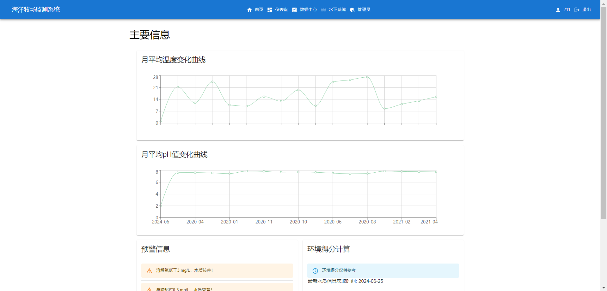
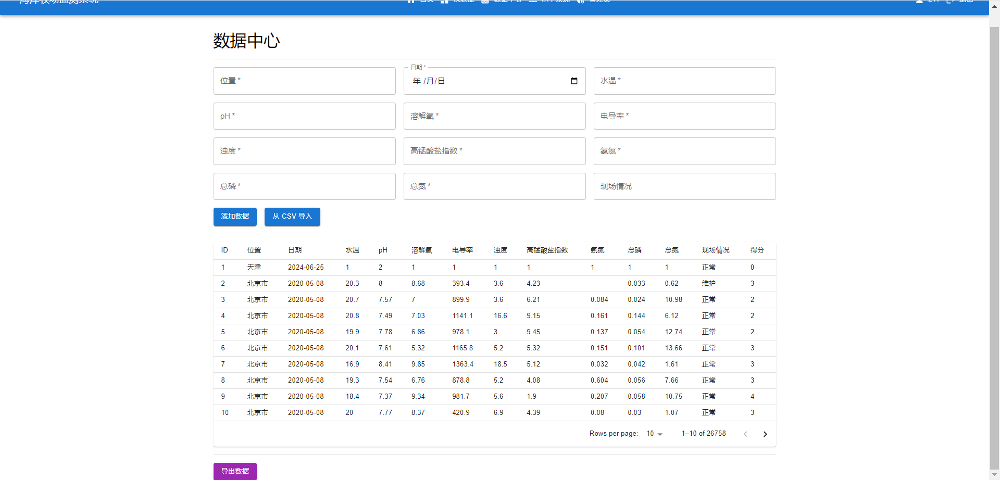
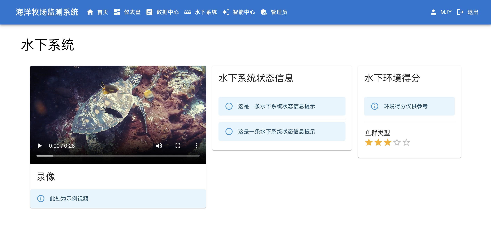

# 海洋牧场智慧可视化系统

2024 NKU 软件工程课程项目。

使用 React + TypeScript + Flask + MySQL 实现的海洋牧场智慧可视化系统。

GitHub 地址：[https://github.com/JuniMay/ocean-monitor](https://github.com/JuniMay/ocean-monitor)

## 运行

确保安装了 Node.js 以及 MySQL。

首先在 `server/app.py` 中配置数据库连接信息。之后运行以下命令：

```bash
cd server
pip install -r requirements.txt
python app.py
```

然后在 `client` 目录下运行：

```bash
npm start
```

## 项目运行界面




