# 软件工程大作业报告

| 姓名   | 学号    |
| ------ | ------- |
| 梅骏逸 | 2111876 |
| 汤志文 | 2111441 |
| 熊宇轩 | 2010056 |
| 李潇逸 | 2111454 |
| 刘宇宸 | 2113103 |

GitHub 地址：[https://github.com/JuniMay/ocean-monitor](https://github.com/JuniMay/ocean-monitor)

安装、允许、调试等具体命令可参考 README 文件。

## 项目概述

### 开发背景

中国在全球渔业养殖中具有重要地位。然而，目前我国水产养殖系统存在一系列问题。国外采用现代水质传感器技 术和在线监控系统来全面监控养殖环境，并通过自动化养殖设备实现环境控制，提高效率，对环境起到积极作用。 为了应对这些问题，中国在十四五发展计划中计划构建“物联网+海洋牧场”，通过物联网、大数据、云计算等现代信 息技术，建立全面、实时、智能的养殖监控系统，精确控制养殖环境，提高效率，减少病害的发生。

### 项目目标

实现一个海洋牧场监测系统，实现数据处理分析可视化、报警通知、用户信息管理等功能。

### 开发环境

使用 Docker Compose 进行部署，使用 Flask 框架开发后端，使用 React + MUI 库实现前端。

在 Windows，Linux 以及 macOS 等操作系统上均可运行。

### 可行性分析

#### 1. **系统功能和特点**

- **海洋牧场监测可视化系统**：这是一个非常有潜力的应用领域，尤其是在现代农业和水产养殖中。随着技术的发展，智能化管理和监控对提高生产效率和降低风险至关重要。

- **数据处理与分析模块**：该模块对存储在分部署管理系统中的数据进行处理和分析，生成可视化所需的数据。这确保了数据的准确性和及时性。

- **可视化展示模块**：通过图形化展示各种关键数据（如地图、天气数据、月平均温度和pH值变化曲线、环境得分等），使用户可以直观地了解海洋牧场的运行状况和趋势。这对于决策支持和日常管理非常重要。

- **报警与通知模块**：实时监控环境得分并在发现问题时报警，这能帮助用户及时采取措施，减少风险。

- **用户信息模块**：通过账号管理系统，实现了用户权限区分和管理，提高了系统的安全性和管理效率。

- **移动端与电脑端显示**：支持多平台显示，增加了系统的灵活性和易用性。

#### 2. **技术栈**

- **Docker Compose**：使用 Docker Compose 进行部署，提高了系统的可移植性和可扩展性。利用 Docker 进行部署也便于环境配置和版本管理。

- **Flask 框架**：Flask 是一个轻量级的 Python 框架，适合用于快速开发和部署。其灵活性使得添加新功能和维护现有功能变得更加容易。

- **React + MUI 库**：React 是一个广泛使用的前端库，具有良好的性能和社区支持。MUI 库提供了丰富的 UI 组件，使前端开发更加高效。

#### 3. **未来发展计划**

- **智能化模块**：未来计划增加鱼类图像识别、运动轨迹追踪、体长体重预测等功能。这些功能的实现将极大地提高系统的智能化水平和用户体验。

### 可行性分析结论

#### 优点

1. **技术选择合理**：使用 Docker Compose、Flask 和 React 等技术，确保系统的可扩展性、易维护性和高效开发。
2. **功能设计全面**：涵盖数据处理、可视化展示、报警通知、用户管理等各个方面，功能齐全。
3. **支持多平台**：同时支持移动端和电脑端，增加了用户的使用便利性。
4. **未来发展方向明确**：智能化功能的加入将进一步提升系统的竞争力和吸引力。

#### 挑战

1. **数据来源和更新**：需要确保数据的实时性和多样性，以满足系统对数据的需求。
2. **智能化模块实现**：图像识别和轨迹追踪等智能化功能的实现可能需要较高的技术投入和算法支持。
3. **用户体验优化**：随着功能的增加，需要不断优化用户体验，确保系统的易用性。

### 项目计划

| 阶段                  | 时间段     | 任务内容                                                 |
|-----------------------|------------|----------------------------------------------------------|
| 项目规划与需求分析    | 第1-2周    | 明确需求，制定计划，确定技术栈与架构设计                 |
| 系统设计              | 第1-2周    | 数据库设计，前后端架构设计，API设计，界面设计            |
| 数据处理与分析模块    | 第3-4周    | 数据采集、分析与处理逻辑开发                       |
| 可视化展示模块        | 第5-6周    | 前端开发，数据可视化组件开发，用户交互设计               |
| 报警与通知模块        | 第7周      | 环境得分计算逻辑，报警触发机制与通知系统开发             |
| 用户信息模块          | 第8周      | 用户注册、登录、权限管理，用户信息管理界面开发           |
| 测试与优化            | 第9-11周   | 集成测试、性能测试与优化，修复bug              |
| 部署与上线            | 第12周     | Docker Compose 部署配置，服务器环境配置与部署             |

## 需求分析与系统设计

### 需求分析

1. **核心功能**
   - 数据处理与分析模块：处理和分析存储在系统中的数据，生成可视化所需的数据。
   - 可视化展示模块：以图形化的方式展示处理后的数据，包括地图、天气数据、温度变化曲线、pH值变化曲线等，并计算环境得分。
   - 报警与通知模块：在点击数据后，发现环境得分为0则进行报警。
   - 用户信息模块：用户注册登录、权限管理，管理员可降级为普通用户。

2. **附加功能**
   - 支持移动端与电脑端显示。
   - 未来计划增加智能化模块，如鱼类图像识别、运动轨迹追踪、生长情况预测等。

3. **技术需求**
   - 使用 Docker Compose 进行部署。
   - 后端使用 Flask 框架。
   - 前端使用 React 和 MUI 库。

### 系统设计

1. **架构设计**
   - **前端**：使用 React + MUI 库构建，负责用户界面和交互。
   - **后端**：使用 Flask 框架，负责数据处理、业务逻辑和 API 服务。
   - **数据库**：使用 MySQL  存储和管理数据。
   - **容器化**：使用 Docker Compose 进行部署，确保系统的可移植性和可扩展性。

2. **模块设计**
   - **数据处理与分析模块**
     - 数据清洗与预处理
     - 数据分析与处理逻辑

   - **可视化展示模块**
     - 图表、地图、仪表盘等可视化组件
     - 数据展示逻辑与用户交互设计

   - **报警与通知模块**
     - 环境得分计算逻辑
     - 报警触发机制与通知系统

   - **用户信息模块**
     - 用户注册与登录
     - 权限管理
     - 用户信息管理

### 详细设计

#### 前端设计

- 使用 React 构建网页框架
- 使用 MUI 库提供的组件实现用户界面
- 设计响应式布局，支持移动端和电脑端显示

#### 后端设计

- 使用 Flask 框架开发 API 接口
- 处理数据请求和响应，执行业务逻辑
- 数据库操作逻辑

#### API 设计

- 用户登录API

```python
@app.route("/api/login", methods=["POST"])
def login():
    data = request.get_json()
    username = data["username"]
    password = data["password"]
    user = User.query.filter_by(username=username).first()
    if user and check_password_hash(user.password_hash, password):
        return jsonify({
            "message": "Login successful",
            "username": user.username,
            "role": user.role  # 将角色返回客户端
        })
    else:
        return jsonify({"message": "Invalid username or password"}), 401
```

- 用户注册API

```python
@app.route("/api/register", methods=["POST"])
def register():
    data = request.get_json()
    username = data["username"]
    password = data["password"]
    role = data["role"]
    
    # 检查用户名是否已存在
    existing_user = User.query.filter_by(username=username).first()
    if existing_user:
        return jsonify({"message": "用户名已存在"}), 409
    # 检查管理员角色是否已存在
    existing_admin = User.query.filter_by(role="admin").first()
    if role == "admin" and existing_admin:
        return jsonify({"message": "您不能注册管理员账户"}), 409

    # 创建新用户
    new_user = User(username=username, role=role, password_hash=generate_password_hash(password))
    db.session.add(new_user)
    db.session.commit()
    return jsonify({
        "message": "Registration successful",
        "username": new_user.username,
        "role": new_user.role
    })
```

- 计算环境得分函数

```typescript
const calculateScore = (dissolvedOxygen: number, permanganate_index: number, ammonia_nitrogen: number, total_phosphorus: number, pH: number): number => {
    if (pH >= 6 && pH <= 9) {
        if (dissolvedOxygen >= 7.5 && permanganate_index <= 2 && ammonia_nitrogen <= 0.15 && total_phosphorus <= 0.02) return 5;
        if (dissolvedOxygen >= 6 && permanganate_index <= 4 && ammonia_nitrogen <= 0.5 && total_phosphorus <= 0.1) return 4;
        if (dissolvedOxygen >= 5 && permanganate_index <= 6 && ammonia_nitrogen <= 1 && total_phosphorus <= 0.2) return 3;
        if (dissolvedOxygen >= 3 && permanganate_index <= 10 && ammonia_nitrogen <= 1.5 && total_phosphorus <= 0.3) return 2;
        if (dissolvedOxygen >= 2 && permanganate_index <= 15 && ammonia_nitrogen <= 2 && total_phosphorus <= 0.4) return 1;
    }
    return 0;
};
```

- 发送预警信息

```typescript
const handleRowClick = (row: HydroData) => {
    const score = calculateScore(row.dissolved_oxygen, row.permanganate_index, row.ammonia_nitrogen, row.total_phosphorus, row.pH);
    if (score === 0) {
      alert(`预警：ID为${row.id}的记录得分为0！`);
    }
    setSelectedData(row); // 设置选中的数据
};
```

- 获取所有用户

```python
@app.route("/api/users", methods=["GET"])
def get_users():
    users = User.query.all()
    return jsonify([
        {"id": user.id, "username": user.username, "role": user.role}
        for user in users
    ])
```

- 更新用户角色

```python
@app.route("/api/users/<int:user_id>", methods=["PUT"])
def update_user_role(user_id):
    data = request.get_json()
    new_role = data["role"]
    user = db.session.get(User, user_id)
    if user:
        user.role = new_role
        db.session.commit()
        return jsonify({"message": "User role updated"})
    else:
        return jsonify({"message": "User not found"}), 404
```

- 添加水质数据

```python
@app.route("/api/hydrodata", methods=["POST"])
def add_hydrodata():
    data = request.get_json()
    new_data = HydroData(
        location=data["location"],
        date=datetime.strptime(data["date"], "%Y-%m-%d"),
        water_temperature=data["water_temperature"],
        pH=data["pH"],
        dissolved_oxygen=data["dissolved_oxygen"],
        conductivity=data["conductivity"],
        turbidity=data["turbidity"],
        permanganate_index=data["permanganate_index"],
        ammonia_nitrogen=data["ammonia_nitrogen"],
        total_phosphorus=data["total_phosphorus"],
        total_nitrogen=data["total_nitrogen"],
        site_condition=data["site_condition"],
    )
    db.session.add(new_data)
    db.session.commit()
    return jsonify({"message": "HydroData added successfully", "data": data})
```

- 获取所有水质数据

```python
@app.route("/api/hydrodata", methods=["GET"])
def get_hydrodata():
    hydrodata = HydroData.query.all()
    return jsonify([
        {
            "id": data.id,
            "location": data.location,
            "date": data.date.strftime("%Y-%m-%d"),
            "water_temperature": data.water_temperature,
            "pH": data.pH,
            "dissolved_oxygen": data.dissolved_oxygen,
            "conductivity": data.conductivity,
            "turbidity": data.turbidity,
            "permanganate_index": data.permanganate_index,
            "ammonia_nitrogen": data.ammonia_nitrogen,
            "total_phosphorus": data.total_phosphorus,
            "total_nitrogen": data.total_nitrogen,
            "site_condition": data.site_condition,
        }
        for data in hydrodata
    ])
```

- 导出水质数据为 CSV

```python
@app.route("/api/export/hydrodata", methods=["GET"])
def export_hydrodata():
    hydrodata = HydroData.query.all()

    def generate():
        data = io.StringIO()
        writer = csv.writer(data)

        writer.writerow(["省份", "监测时间", "水温", "pH", "溶解氧", "电导率", "浊度", "高锰酸盐指数", "氨氮", "总磷", "总氮", "站点情况"])

        for row in hydrodata:
            writer.writerow([
                row.location,
                row.date.strftime("%Y-%m-%d"),
                row.water_temperature,
                row.pH,
                row.dissolved_oxygen,
                row.conductivity,
                row.turbidity,
                row.permanganate_index,
                row.ammonia_nitrogen,
                row.total_phosphorus,
                row.total_nitrogen,
                row.site_condition,
            ])
            data.seek(0)
            yield data.read()
            data.truncate(0)
            data.seek(0)

    headers = {
        "Content-Disposition": "attachment; filename=hydrodata.csv",
        "Content-Type": "text/csv",
    }

    return Response(generate(), headers=headers)
```

- 导入水质数据从 CSV

```python
@app.route("/api/import/hydrodata", methods=["POST"])
def import_hydrodata():
    data = request.files
    if "csv" not in data:
        return jsonify({"

message": "No file part"}), 400

    file = data["csv"]
    if file.filename == "":
        return jsonify({"message": "No selected file"}), 400

    if file and allowed_file(file.filename):
        filename = secure_filename(file.filename)
        file.save(os.path.join(app.config["UPLOAD_FOLDER"], filename))

        with open(os.path.join(app.config["UPLOAD_FOLDER"], filename), newline="") as csvfile:
            reader = csv.DictReader(csvfile)
            for row in reader:
                new_data = HydroData(
                    location=row["省份"],
                    date=datetime.strptime(row["监测时间"], "%Y-%m-%d"),
                    water_temperature=row["水温"],
                    pH=row["pH"],
                    dissolved_oxygen=row["溶解氧"],
                    conductivity=row["电导率"],
                    turbidity=row["浊度"],
                    permanganate_index=row["高锰酸盐指数"],
                    ammonia_nitrogen=row["氨氮"],
                    total_phosphorus=row["总磷"],
                    total_nitrogen=row["总氮"],
                    site_condition=row["站点情况"],
                )
                db.session.add(new_data)
            db.session.commit()

        return jsonify({"message": "HydroData imported successfully"})
    else:
        return jsonify({"message": "File type not allowed"}), 400
```

### 数据库设计

#### `User` 表

| 列名          | 类型           | 描述                  |
|---------------|----------------|-----------------------|
| id            | Integer        | 主键                  |
| username      | String(100)    | 用户名，唯一，不为空   |
| password_hash | String(2048)   | 密码哈希值，不为空     |
| role          | String(20)     | 角色，不为空           |

#### `HydroData` 表

| 列名                  | 类型           | 描述                      |
|-----------------------|----------------|---------------------------|
| id                    | Integer        | 主键                      |
| location              | String(100)    | 监测地点，不为空           |
| date                  | Date           | 监测时间，不为空           |
| water_temperature     | Float          | 水温，可为空               |
| pH                    | Float          | pH 值，可为空              |
| dissolved_oxygen      | Float          | 溶解氧量，可为空           |
| conductivity          | Float          | 电导率，可为空             |
| turbidity             | Float          | 浊度，可为空               |
| permanganate_index    | Float          | 高锰酸盐指数，可为空       |
| ammonia_nitrogen      | Float          | 氨氮，可为空               |
| total_phosphorus      | Float          | 总磷，可为空               |
| total_nitrogen        | Float          | 总氮，可为空               |
| site_condition        | String(100)    | 现场情况描述，可为空       |

定义了两个主要的数据库表结构：`User` 表存储用户信息，`HydroData` 表存储水质监测数据。

## UI设计

### 使用的CSS框架

在海洋牧场智慧可视化系统中，我们选择使用了 MUI 作为主要的UI组件库。MUI 在 React 之上提供了一套现代、响应式的组件，帮助我们快速搭建出美观的用户界面。

#### 响应式设计/移动设备支持

我们的项目非常注重响应式设计，确保在不同尺寸的设备上都能有良好的用户体验。我们主要通过以下方式实现响应式设计：

- **使用 MUI 的 Grid 系统**：MUI提供了强大的Grid系统，帮助我们实现页面布局的响应式设计。通过调整Grid的属性，我们可以轻松地在不同的屏幕尺寸下调整布局。
- **使用 Media Queries**：我们在组件中使用了MUI的`useMediaQuery`钩子，根据屏幕尺寸动态调整组件的显示内容和布局。例如，在导航栏中，我们根据屏幕尺寸选择不同的菜单显示方式。

```tsx
const theme = useTheme();
const isMobile = useMediaQuery(theme.breakpoints.down("md"));
```

#### 主要界面设计

##### 导航栏

导航栏是整个系统的核心部分，我们在设计时考虑到了不同用户角色的需求，以及在移动设备和桌面设备上的不同展示方式。

- **桌面设备**：在桌面设备上，导航栏展示完整的菜单按钮，用户可以直接点击进行页面跳转。
- **移动设备**：在移动设备上，导航栏折叠为一个菜单图标，点击后会弹出菜单列表，用户可以选择需要跳转的页面。

```tsx
<AppBar position="static">
  <Toolbar>
    <Typography variant="h6" component="div" margin={2} sx={{ flexGrow: 1 }}>
      海洋牧场监测系统
    </Typography>
    {isMobile ? (
      <>
        <IconButton edge="start" color="inherit" aria-label="menu" onClick={handleMenuOpen}>
          <MenuIcon />
        </IconButton>
        <Menu anchorEl={anchorEl} open={Boolean(anchorEl)} onClose={handleMenuClose}>
          <MenuItem component={Link} to="/home" onClick={handleMenuClose}>
            <HomeIcon /> 首页
          </MenuItem>
          {/* 其他菜单项 */}
        </Menu>
      </>
    ) : (
      <>
        <Button startIcon={<HomeIcon />} color="inherit" component={Link} to="/home">
          首页
        </Button>
        {/* 其他按钮 */}
      </>
    )}
  </Toolbar>
</AppBar>
```

##### 仪表盘

仪表盘对温度数据和pH数据进行了分析和可视化显示。以下是对原始数据进行处理的代码片段：

```javascript
const rawData = response.data;

// 初始化一个对象monthlyData，用于存储每个月的总温度、总pH值及数据条目数
const monthlyData = {};

// 遍历原始数据，根据年月进行数据汇总
rawData.forEach(item => {
  const month = item.date.slice(0, 7); // 提取年月，格式为 'YYYY-MM'

  // 初始化当前月份的数据
  if (!monthlyData[month]) {
    monthlyData[month] = { totalTemp: 0, totalPH: 0, count: 0 };
  }

  // 累加水温和pH值，并增加数据条目计数
  monthlyData[month].totalTemp += item.water_temperature;
  monthlyData[month].totalPH += item.pH;
  monthlyData[month].count += 1;
});

// 格式化数据，计算每个月的平均温度和平均pH值
const formattedData = Object.keys(monthlyData).map(month => ({
  month, // 月份，格式为 'YYYY-MM'
  averageTemperature: monthlyData[month].totalTemp / monthlyData[month].count, // 平均温度
  averagePH: monthlyData[month].totalPH / monthlyData[month].count, // 平均pH值
}));

// 将处理后的数据设置到状态中，便于前端进行可视化显示
setData(formattedData);
```

##### 代码说明

1. **原始数据读取**：从响应中获取原始数据并存储在`rawData`中。
2. **数据初始化与汇总**：
    - 定义一个`monthlyData`对象，用于存储每个月的总温度、总pH值和数据条目数。
    - 遍历`rawData`，根据日期提取年月，并在`monthlyData`对象中初始化相应月份的数据。
    - 对每条数据中的水温和pH值进行累加，并增加数据条目计数。
3. **数据格式化**：
    - 遍历`monthlyData`对象的键，计算每个月的平均温度和平均pH值，并将结果存储在`formattedData`数组中。
4. **数据设置**：将格式化后的数据通过`setData`函数设置到组件状态中，以便在前端进行可视化显示。

##### 数据中心

数据中心页面展示了各种监测数据，包括传感器数据、水质数据等。我们使用了 Recharts 库来展示图表，确保数据的可视化效果优美且直观。

```tsx
<ResponsiveContainer width="100%" height={400}>
  <LineChart data={data}>
    <XAxis dataKey="name" />
    <YAxis />
    <Tooltip />
    <Legend />
    <Line type="monotone" dataKey="pv" stroke="#8884d8" />
    <Line type="monotone" dataKey="uv" stroke="#82ca9d" />
  </LineChart>
</ResponsiveContainer>
```

通过使用Material-UI和Recharts，我们不仅提高了开发效率，还确保了系统在不同设备上的一致性和用户体验。响应式设计和现代化的UI组件，使得我们的海洋牧场智慧可视化系统在界面美观性和功能性上都达到了较高的标准。

## 系统测试

### 测试环境

1. **硬件环境**
   - 高性能服务器：用于数据处理和存储，确保系统在高负载下的稳定性和性能。
   - 移动设备和电脑：用于测试系统的响应式设计，确保在不同设备上的用户体验一致。

2. **软件环境**
   - Docker：使用 Docker 和 Docker Compose 进行测试环境的部署，确保环境一致性和跨平台性。
   - 自动化测试工具：使用 Locust 进行性能测试，通过 postman、curl 等工具进行单元和 API 测试，并通过实际用户的使用流程进行集成测试。

### 功能测试

#### 测试方法

功能测试主要通过手动测试的方式进行，确保系统的各项功能在实际使用中的正确性。具体测试方法包括：

1. **单元测试**
   - 对每个模块的核心功能进行单元测试，确保各模块功能的正确性。
   - 使用 postman、curl 对接口进行请求测试，覆盖系统的主要功能点。

2. **集成测试**
   - 测试各模块之间的集成，确保模块之间的数据流和交互正确。
   - 通过调用 API 接口，验证前后端的集成是否正常。

3. **系统测试**
   - 对整个系统进行全面测试，确保所有功能在实际使用中的正确性。
   - 从用户注册、登录，到数据的添加、查询、导入导出等，进行全流程测试。

#### 功能测试结果

- 用户注册和登录功能：测试了不同角色（普通用户和管理员）的注册和登录，验证了用户名唯一性和权限管理功能。
- 数据处理和分析功能：测试了数据的添加、查询、导出和导入，确保数据处理的准确性和及时性。
- 可视化展示功能：测试了不同设备（移动端和电脑端）上的数据可视化展示，确保响应式设计的正确性。
- 报警和通知功能：测试了环境得分计算和预警通知功能，确保异常情况的及时告警。

### 性能测试

#### 测试工具

我们使用 Locust 编写测试脚本进行性能测试，模拟用户对重点接口进行并发访问。我们在 Locust 的网页控制面板中设置 50 名用户同时访问的情况，并从 1 位用户的并发逐渐增长到 50 位，以模拟高并发访问场景，测试系统在高负载下的性能和正确性。性能测试主要包括负载测试、压力测试和响应时间测试。

#### 性能测试方法

1. **负载测试**
   - 模拟大量用户同时访问系统，测试系统在高负载下的性能。
   - 通过设置不同的并发用户数，观察系统的响应时间和吞吐量。

2. **压力测试**
   - 超负载测试，测试系统在超过预期负载情况下的稳定性和恢复能力。
   - 持续增加并发用户数，观察系统是否能够正常运行。

3. **响应时间测试**
   - 测试各主要功能的响应时间，确保系统的用户体验。
   - 记录每个 API 接口的响应时间，分析性能瓶颈。

#### 性能测试结果

在使用 gunicorn，4 个 worker，每个 worker 1个进程的情况下，我们测试了系统在高并发情况下的性能。测试结果截图如下：

- **测试统计截图**：显示了各 API 接口的请求数、失败数、响应时间等统计数据。
  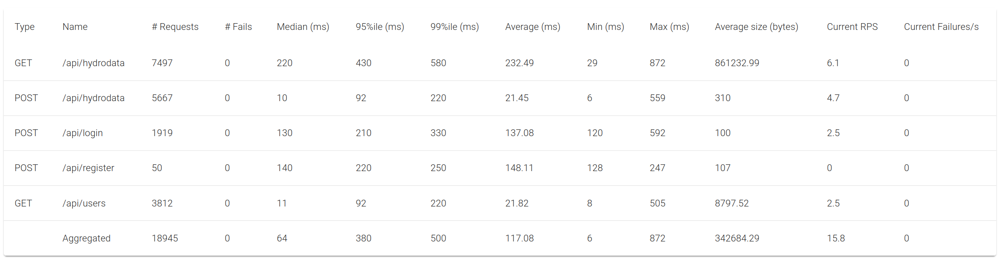

- **测试图表截图**：显示了性能测试过程中各 API 接口的响应时间分布。
  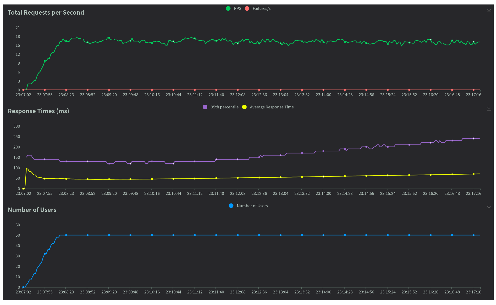

不难发现，我们的接口具有较好的性能，能在用户无法感知的时间内返回所需的数据，测试的模拟用户从1位逐渐增长到50位，我们的系统最终能够在较长时间内承受50名用户的并发访问，这足以满足海洋牧场监控系统的需求。

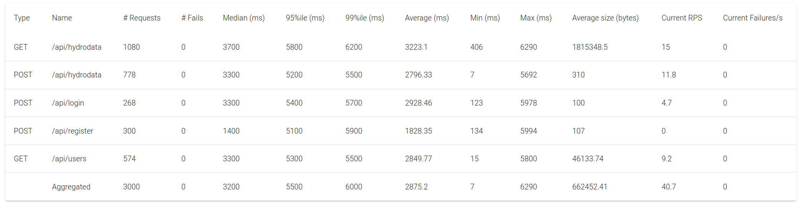

而即使我们将访问并发用户增加到300位，即使在请求响应时延上出现了一定的增长，我们的系统仍然能够正常运行，这表明我们的系统具有较好的弹性，能应对短时间高并发的访问，这使得其能够适应海洋牧场监控系统未来的发展。

通过功能测试和性能测试，我们验证了系统在不同负载下的性能和稳定性，确保了系统功能的正确性和用户体验的良好性。未来我们将继续优化系统，提升性能，确保在高并发和复杂应用场景下的稳定性和可靠性。

## 项目管理

### 参与人员及分工

- 梅骏逸：负责项目框架的搭建，编写数据预处理和数据导入部分，运行调试项目。
- 汤志文：负责项目框架的搭建，完成了地图和天气接口化，完成数据导出，实现手动输入添加数据的功能，完成数据分页显示，运行调试项目。
- 熊宇轩：完善用户信息模块（不同用户权限不同且可进行切换），编写docker compose，实现项目移动端化，完成预警信息功能，完成locust测试脚本，运行调试项目。
- 李潇逸：实现数据分析和可视化（可视化显示温度和pH），运行调试项目。
- 刘宇宸：编写地图和天气模块（未导入项目），运行调试项目。

### 项目进展记录

- 5.12 基本功能实现
- 5.27 实现数据添加功能
- 5.29 实现从 CSV 文件上传数据功能
- 6.2 支持移动端菜单栏布局、Docker Compose 部署
- 6.20 完成地图和天气模块显示

### 项目管理工具

使用 Git 和 GitHub 完成团队协作和版本控制。

## 用户手册

### 海洋牧场监控系统用户手册

欢迎使用海洋牧场监控系统！本手册将为您介绍系统的功能和操作步骤。

---

#### 用户注册

1. 打开海洋牧场监控系统的注册页面。
2. 输入您的用户名和密码，选择用户类型（用户或管理员）。
3. 阅读并同意用户协议。
4. 点击注册按钮。

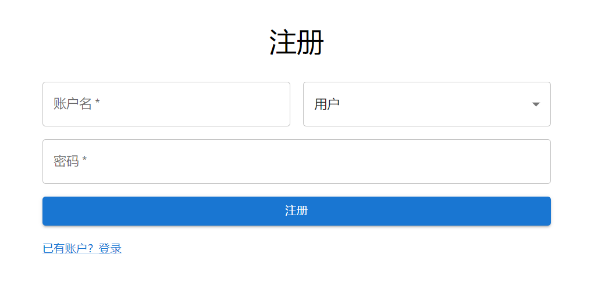

---

#### 登录系统

1. 打开海洋牧场监控系统的登录页面。
2. 输入您的用户名和密码。
3. 点击登录按钮。

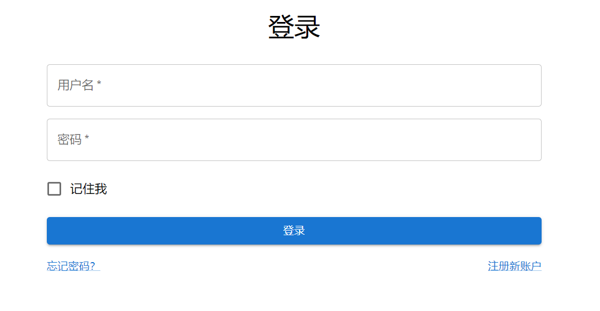

提示

- 请在公共场合避免自动保存密码，以保证账户安全。

---

#### 海洋牧场数据展示

1. 在菜单中选择数据中心。
2. 查看海洋牧场的各项水质指标数据。

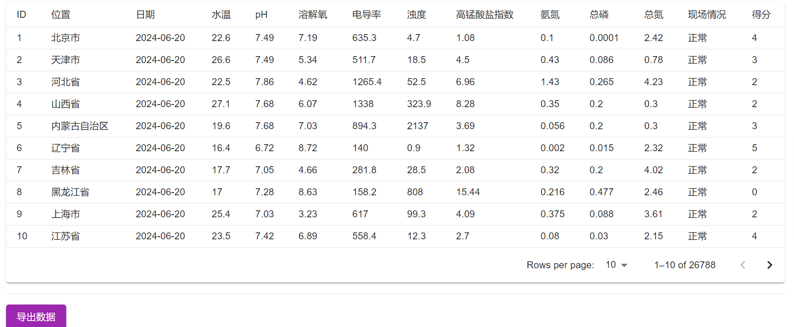

提示

- 温度数据和pH数据在仪表盘模块中有详细的分析。
- 可以导出图表为图片或PDF格式，便于分享和报告。

---

#### 报警与通知

1. 设置报警阈值是水质环境得分为0。
2. 当监测到被点击的数据处于异常情况时，将发送弹窗报警信息

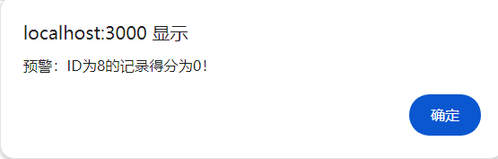

---

#### 用户信息管理

1. 在系统中管理用户信息和权限。
2. 添加、编辑或删除用户账户。
3. 分配用户角色和权限，确保数据安全。

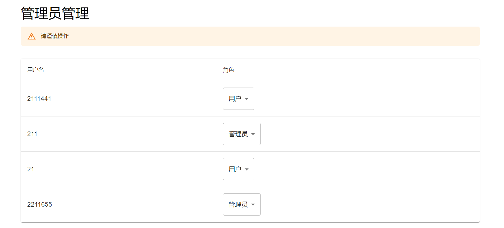

提示

- 仅管理员可以管理用户信息和权限。
- 定期审核用户权限，确保系统安全。

---

#### 数据管理与分析

1. 对海洋牧场监测数据进行处理和分析。
2. 系统提供数据的统计和评估功能，如温度和pH值分析。
3. 数据分析后生成图表。

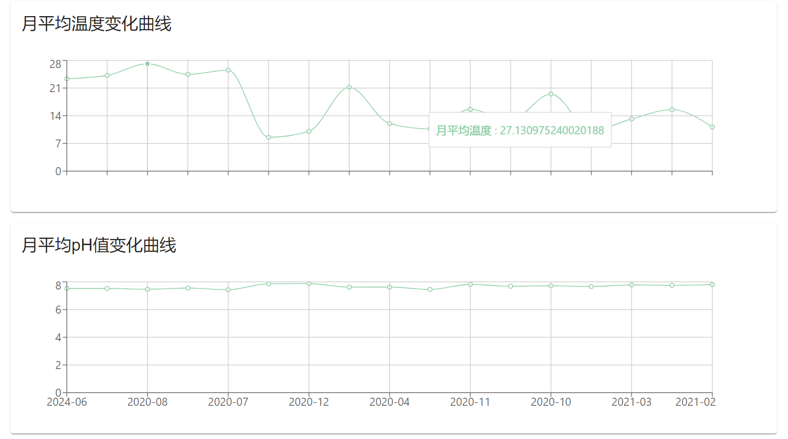

---

#### 地图展示功能

1. 在地图上显示海洋牧场的位置和相关信息。
2. 查看不同地点的地理和气象信息。

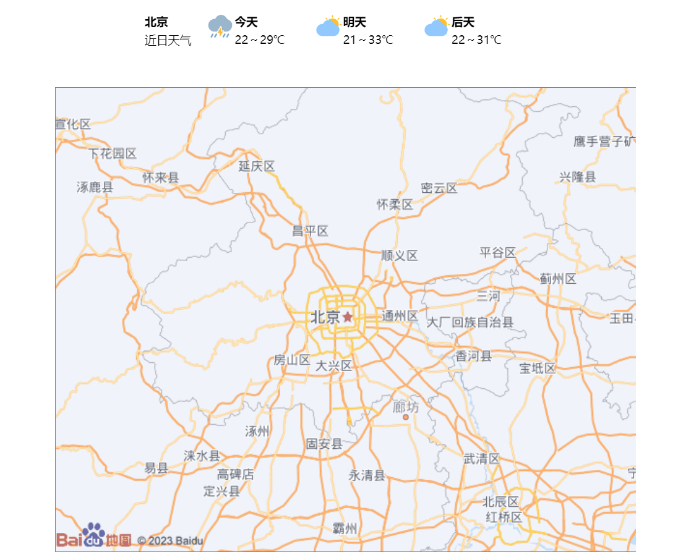

---

#### 导出与导入数据

1. 将监测数据导出为CSV格式文件，便于进一步分析和备份。
2. 从CSV文件导入新的监测数据到系统中，保持数据更新。
3. 手动输入数据，确保数据的及时性和准确性。

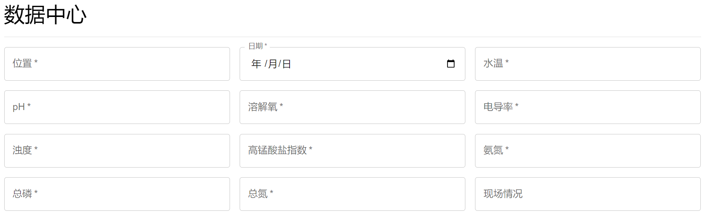
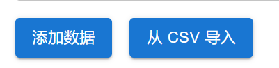

提示

- 导入数据时，请确保文件格式正确，以免出现数据错误。
- 定期备份数据，防止数据丢失。

---

#### 用户支持与帮助

如需进一步帮助或支持，请联系系统管理员或技术支持团队。

---

#### 结束使用

请在使用系统后安全退出，确保您的账户安全。

提示

- 退出系统前，请保存所有未完成的工作。
- 在公共电脑上使用系统时，确保浏览器不保存您的登录信息。

---

### 感谢您使用海洋牧场监控系统

如果您有任何问题或需要进一步的帮助，请随时联系我们的技术支持团队。

希望这份用户手册能帮助您更好地使用海洋牧场监控系统。祝您使用愉快！
